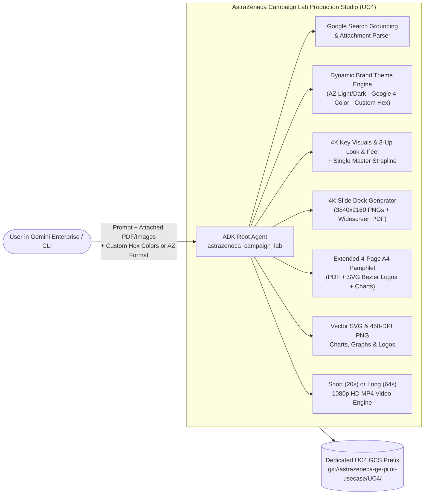

# AstraZeneca Campaign Lab (`UC4`)

> **Generic Multimodal Campaign, Brand Look & Feel & Scientific Communications Studio**  
> **Powered by Google ADK · Vertex AI Agent Engine · Gemini Enterprise · Google Search Grounding**

---

## 1. Executive Overview

**AstraZeneca Campaign Lab (`UC4`)** is a **100% generic, brand-agnostic and product-agnostic** creative and scientific campaign production studio deployed on **Vertex AI Agent Engine** and **Gemini Enterprise**.

Unlike product-specific agents, **AstraZeneca Campaign Lab** contains **zero hardcoded product or Calquence assumptions**. It dynamically adapts to any investigational molecule (e.g., `AZD9550`), commercial therapy, disease awareness initiative, or corporate/partner brand theme.

### Key Capabilities
1. **Live Google Search Grounding (`google_search`)**:
   - Answers clinical, scientific, mechanism-of-action, epidemiological, and market queries with live grounded web citations via `google-genai` (`types.Tool(google_search=types.GoogleSearch())`).
   - **No Discovery Engine Datastore required** (`ENABLE_DATASTORE=false`).
2. **Multimodal Document & Image Attachment Ingestion**:
   - Users can attach **PDF slide decks (`.pdf`)**, **Word briefs (`.docx`)**, **text/markdown files**, or **reference images (`.png`, `.jpg`, `.webp`)** directly in chat.
   - The agent extracts slide structures, scientific claims, quantitative endpoints, and visual cues to produce cohesive deliverables.
3. **Dynamic Brand Theme & Custom Color Palette Engine**:
   - **Follows Custom User Prompts**: For example, when prompted:
     ```text
     Use white background for the slides, grey color for text and following branding colors below:
     Blue: Hex #4285F4, RGB (66, 133, 244)
     Red: Hex #EA4335, RGB (234, 67, 53)
     Yellow: Hex #FBBC04, RGB (251, 188, 4)
     Green: Hex #34A853, RGB (52, 168, 83)
     ```
     every generated slide, chart, brochure page, and video automatically renders with a `#FFFFFF` white background, `#5F6368` grey typography, and the exact 4-color `#4285F4 / #EA4335 / #FBBC04 / #34A853` brand system.
   - **AstraZeneca Corporate Formats**: Or asks the user if they want **AstraZeneca Corporate Light Executive** (`#FFFFFF` background, Mulberry `#830051`, Gold `#F0AB00`, Navy `#003865`, Teal `#00A082`) or **AstraZeneca Dark Metabolic Plum** (`#1E0514` background, Gold `#F0AB00`, Teal `#00A082`, Coral `#E40046`), complete with official resolution-independent **AstraZeneca vector SVG & PNG logos**.
4. **3 Brand Look & Feel Variations + Single Master Strapline + Anchor Recommendation**:
   - Generates 3 distinct 4K visual directions (e.g., *Synchronized Rowing Pair*, *Crystalline Dual Agonist Molecule*, *Vitality Couple Walking*) unified under **one Single Master Strapline** (e.g., *"TWO DISTINCT PATHWAYS. ONE BALANCED FORCE."*) and recommends a primary **Anchor Look & Feel**.
5. **Full Tangible Deliverable Suite**:
   - **4K Widescreen Slide Deck (`3840 × 2160` PNGs + Widescreen `1920 × 1080` PDF)** with extra-large executive typography (`88px` titles, `62px` card headers, `54px` body copy).
   - **Full Extended Multi-Page A4 Information Pamphlet (`.pdf` + page `.png`s)** with embedded 4K visuals, vector SVG charts, synergy diagrams, and logos.
   - **Vector `.svg` & `450-DPI .png` Charts, Pathway Diagrams & Custom Brand Crests**.
   - **Short (`16s–24s`) or Long (`60s–80s`) 1080p HD Campaign Videos (`.mp4`)** with lower-third captions and ambient harmonic soundtrack.
   - **Editable Word (`.docx`) Campaign Creative Brief**.

---

## 2. Architecture



---

## 3. Repository Structure

```text
UC4/
├── .env.example                     # Environment template (UC4 prefix, Google Grounding enabled, no Datastore)
├── Dockerfile                       # Cloud Run container definition (Python 3.12 + ffmpeg)
├── pyproject.toml                   # Package metadata & pytest configuration
├── requirements.txt                 # Pinned Python dependencies
├── run_campaign_lab.py              # CLI runner for any campaign, theme, or video length
├── server.py                        # FastAPI HTTP service
├── agents/
│   ├── adk_conversational_agent.py  # Google ADK conversational root_agent ("astrazeneca_campaign_lab")
│   └── orchestrator_agent.py        # 5-stage end-to-end omnichannel deliverable pipeline
├── assets/
│   └── astrazeneca_logos_svg/       # Official AstraZeneca vector SVG & 4K PNG logos
├── config/
│   ├── brand_guidelines.py          # Dynamic Brand Theme & Hex/RGB Color Palette Parser
│   └── settings.py                  # Centralized Pydantic settings
├── scripts/
│   ├── deploy.sh                    # Uploads UC4 logos to GCS & deploys Reasoning Engine
│   └── deploy_reasoning_engine.py   # Deploys AdkApp & registers "AstraZeneca Campaign Lab" in Gemini Enterprise
├── tests/
│   └── unit/
│       └── test_campaign_lab.py     # Unit tests verifying themes, 4K slides, A4 PDF, SVG charts & MP4 video
└── tools/
    ├── chart_tools.py               # Vector .svg + 450-DPI .png charts & pathway synergy diagrams
    ├── docx_tools.py                # Editable Word (.docx) Campaign Strategy Brief
    ├── grounding_tools.py           # Live Google Search Grounding + PDF/DOCX/Image attachment ingestion
    ├── image_tools.py               # 4K Hero Key Visuals + 3-Up Brand Look & Feel Board + Master Strapline
    ├── logo_tools.py                # Official AstraZeneca SVG Bezier renderer + custom SVG crest generator
    ├── pdf_tools.py                 # Extended 4-page A4 Information Pamphlet PDF + high-res page PNGs
    ├── slide_deck_tools.py          # 4K Widescreen Slide Deck PNGs (3840x2160) + compiled PDF
    └── video_tools.py               # Short (20s) & Long (64s) 1080p HD MP4 campaign video generator
```

---

## 4. Quick Start & Usage

### Run with AstraZeneca Corporate Format
```bash
python run_campaign_lab.py \
  --campaign "AZD9550 Complementary Strategy" \
  --strapline "TWO DISTINCT PATHWAYS. ONE BALANCED FORCE." \
  --theme "astrazeneca_light" \
  --video-length short
```

### Run with Custom Google Branding Prompt
```bash
python run_campaign_lab.py \
  --campaign "Digital Health Innovation" \
  --strapline "CONNECTED INSIGHTS. MEASURABLE OUTCOMES." \
  --theme "use white background for the slides, grey color for text and following branding colors below: Blue: Hex #4285F4, RGB (66, 133, 244), Red: Hex #EA4335, RGB (234, 67, 53), Yellow: Hex #FBBC04, RGB (251, 188, 4), Green: Hex #34A853, RGB (52, 168, 83)" \
  --no-az-logo \
  --video-length long
```

### Deploy to Vertex AI Agent Engine & Gemini Enterprise
```bash
bash scripts/deploy.sh
```
